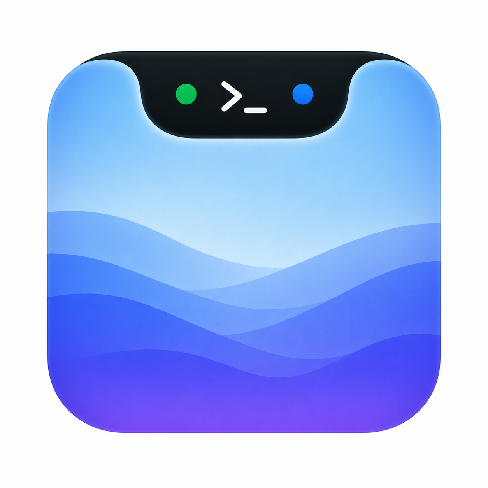

# ShellIsland

macOS 刘海下的像素风胶囊，实时监控你的终端任务。


## 这是什么

ShellIsland 是一个常驻 macOS 菜单栏刘海下方的胶囊形工具。它监控 kitty 终端中运行的 `brew`、`claude`（Claude Code）、`npm run` 等任务，并用复古像素风格展示状态。



### 核心功能

- **实时监控** — 基于 libproc 零 fork 扫描 kitty 进程树，1 秒轮询
- **Attention 检测** — 自动识别密码输入、y/n 确认、Claude Code 权限请求等交互场景，弹出黄色 NEED 提醒
- **快捷操作** — 一键跳转到对应 kitty 窗口/标签、终止任务、发送 y/n 响应
- **Claude Code Hooks 集成** — 原生支持 SessionStart / PermissionRequest / Stop 事件，弹窗审批工具调用权限
- **收起胶囊** — 像素风格方块动画 + 运行中任务数量，始终可见不打扰

### 支持的任务类型

| 类型 | 说明 |
|------|------|
| `brew` | Homebrew 安装 / 卸载 / 升级 |
| `claude` | Claude Code CLI |
| `npm run` / `pnpm` / `yarn` | Node.js 脚本执行 |

### 前置条件

- macOS 13.7+
- [kitty](https://sw.kovidgoyal.net/kitty/) 终端，需在配置中开启 `allow_remote_control yes`
- 辅助功能权限（用于窗口聚焦 / 跳转）

### 安装

```sh
git clone git@github.com:7neves/shell-island.git
cd shell-island
bash scripts/build.sh
```

构建完成后将 `.app` 拖入 Applications，首次运行按提示授予辅助功能权限。

### 项目结构

```
├── Sources/
│   ├── ShellIslandApp/        # SwiftUI 界面层
│   ├── ShellIslandCore/       # 核心逻辑（进程监控、kitty 集成、hooks）
│   └── ShellIslandHooks/      # Claude Code hooks 可执行文件
├── Tests/                     # 单元测试
├── scripts/                   # 构建 / 运行 / 测试脚本
└── docs/                      # 项目文档
```
